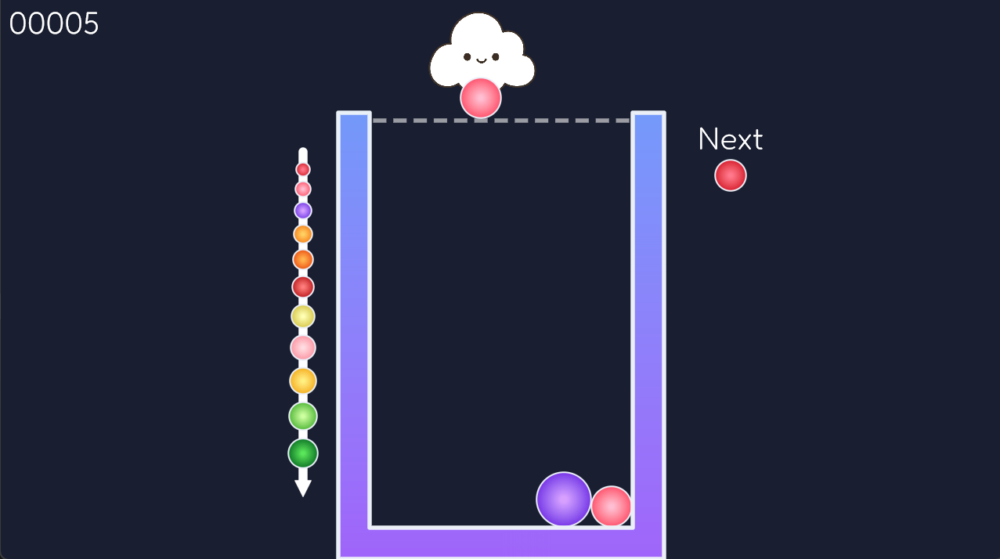

# FruitsGame

A "Suika Game"-style fruit-merging puzzle game built in C# with [MonoGame](https://monogame.net/).

Drop fruits into the container. When two fruits of the same kind touch, they merge into the next fruit in the chain. Stack carefully, chase a high score, and don't let the pile overflow!



## Gameplay

- **Move** — `A` / `D`
- **Drop fruit** — `Space`
- **Quit** — `Escape`

Merging fruits awards points based on their tier, and each merge produces the next, larger fruit up the chain. The game window shows your current score and a preview of the next fruit to drop, along with a guide of every fruit tier.

## Tech Stack

- [.NET 10](https://dotnet.microsoft.com/) / C#
- [MonoGame (DesktopGL)](https://monogame.net/) — rendering and game loop
- [Aether.Physics2D](https://github.com/nkast/Aether.Physics2D) — 2D physics simulation
- [Apos.Shapes](https://github.com/Apos-Games/Apos.Shapes) — shape and text rendering
- [MonoGame.Extended](https://github.com/craftworkgames/MonoGame.Extended) — input handling, camera, and viewport adaptation
- [FontStashSharp](https://github.com/FontStashSharp/FontStashSharp) — font rendering

## Getting Started

### Prerequisites

- [.NET 10 SDK](https://dotnet.microsoft.com/download)
- Windows (the project targets `win-x64`)

### Run

```bash
dotnet run
```

### Build a self-contained executable

```bash
dotnet publish -c Release
```

This produces a single-file, self-contained `win-x64` executable.

## Project Structure

```
FruitsGame.cs        # Game entry point (MonoGame Game class): setup, update loop, drawing
Program.cs           # Application entry point
Core/
  FruitsContainer.cs # Core game logic: physics world, spawning, merging, scoring
  Fruit.cs            # Fruit data (radius, value/tier, physics body)
  Player.cs           # Player-controlled dropper (movement, drop cooldown)
Content/              # Game assets (images, fonts, music, SFX) and MonoGame Content Pipeline config
Icon/                 # Application icon
```

## License

No license specified yet.
